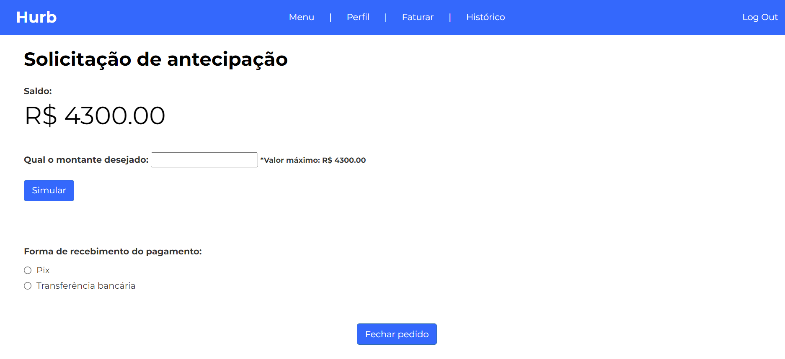

# Inteli - Instituto de Tecnologia e Liderança 

<p align="center">
<a href= "https://www.inteli.edu.br/"></a>
</p>

# Hurb Antecipações

## Webcrias

## Integrantes: <a href="https://www.linkedin.com/in/felipe-silberberg-111998230/">Felipe Silberberg</a>, <a href="https://www.linkedin.com/in/gabrielcaetanonhoncanse/">Gabriel Caetano Nhoncanse</a>, <a href="https://www.linkedin.com/in/gabriel-rocha-pinto-santos-113385231/">Gabriel Rocha</a>, <a href="https://www.linkedin.com/in/gabriela-barretto99/">Gabriela Barretto</a>, <a href="https://www.linkedin.com/in/lu%C3%ADsa-vit%C3%B3ria-leite-silva-681443230/">Luísa Leite</a>, <a href="https://www.linkedin.com/in/renatosilvamachado/">Renato Machado</a>

## Descrição
<br>
Nosso projeto desenvolve uma aplicação web para a Hurb.
<br><br>
<p align="center">
<a href="https://www.hurb.com/br"></a></p><br>
<a href="https://www.hurb.com/br"></a><br>
Com o aumento da demanda dos hoteleiros pelas antecipações de pagamento, a Hurb precisa de uma plataforma que esclareça as taxas, os modos e os dias de pagamento, além de organizar a visualização das solicitações para os hoteleiros e administradores da Hurb. A nossa tarefa será desenvolver essa plataforma e para isso, nos organizamos em 5 sprints, a primeira para análises de mercado, a segunda para desenvolvimento do frontend, na terceira backend, na quarta integração e na quinta ajustes finos e apresentação.
<br><br>

## 🛠 Estrutura de pastas

-Raiz<br>
|<br>
|-->documentos<br>
  &emsp;|-->antigos<br>
  &emsp;|Documentação.pdf<br>
|-->imagens<br>
|-->src<br>
  &emsp;|-->Backend<br>
        &emsp;  |-->DataBase<br>
  &emsp;|-->Frontend<br>
        &emsp;  |-->css<br>
        &emsp;  |-->html<br>
        &emsp;  |-->icons<br>
        &emsp;  |-->js<br>
|readme.md<br>

<b>README.MD</b>: Arquivo que serve como guia e explicação geral sobre o projeto. O mesmo que você está lendo agora.

Há também 3 pastas que seguem da seguinte forma:

<b>Documentos</b>: Aqui estão todos os documentos do projeto, principalmente o <b>Web Application Document</b>. Há uma pasta <b>antigos</b> onde estão todas as versões antigas da documentação.

<b>Imagens</b>: Alguns ícones e logos prontos para serem utilizados e visualizados.

<b>Src</b>: Nesta pasta está todo o código fonte do sistema, pronto para para ser baixado e modificado. Existem duas pastas, <b>Backend</b> e <b>Frontend</b> que contêm, respectivamente, o código do servidor e o código da página web.


## 📈 Exemplo de uso

  A principal função do nosso sistema será a possibilidade do hoteleiro poder fazer o pedido de sua antecipação, por essa tela:
  
<p align="center">
<a href= "file:///C:/Users/Inteli/Documents/GitHub/Projeto1/src/Frontend/public/html/Solicita%C3%A7%C3%A3oAntecipa%C3%A7%C3%A3o.html"></a>
</p>
  


## 💻 Configuração para Desenvolvimento

  Para abrir este projeto você necessita das seguintes ferramentas:
  Em primeiro lugar abra o terminal do seu computador e entre dentro da pasta onde está o projeto. Então rode os comandos: 
  ```sh
install express
```
  
   ```sh
install sqlite3
```
  Por fim rode:
   ```sh
node app.js
```

  
-<b>E também tenha um Navegador web, conectado à internet</b>


## 🗃 Histórico de lançamentos

A cada atualização os detalhes devem ser lançados aqui.

* 0.2.1 - 25/01/2022
    * MUDANÇA: Atualização de docs (código do módulo permanece inalterado)
* 0.2.0 - 15/01/2022
    * MUDANÇA: Remove `setDefaultXYZ()`
    * ADD: Adiciona `init()`
* 0.1.1 - 11/01/2022
    * CONSERTADO: Crash quando chama `baz()` (Obrigado @NomeDoContribuidorGeneroso!)
* 0.1.0 - 10/01/2022
    * O primeiro lançamento adequado
    * MUDANÇA: Renomeia `foo()` para `bar()`
* 0.0.1 - 01/01/2022
    * Trabalho em andamento
* 0.1.1 - 11/01/2022
    * CONSERTADO: Crash quando chama `baz()` (Obrigado @NomeDoContribuidorGeneroso!)
* 0.2.0 - 29/04/2022 - Semana 2
    * O primeiro lançamento adequado
    * MUDANÇA: Renomeia `foo()` para `bar()`
* 0.1.0 - 22/04/2022 - Semana 1
    * Trabalho em andam


* 0.3.4 - 13/06/2022
    * MUDANÇA: Exibição de datas na tela de Faturamento (Após faturar reservas). (Renato Machado)

* 0.3.3 - 10/06/2022
    * Finalização da API da tela de Faturamento. (Solicitação de Antecipação) (Renato Machado)

* 0.3.2 - 09/06/2022
    * MUDANÇA: Integração dos dados bancários na tela de perfil. (Felipe Silberberg)

* 0.3.1 - 08/06/2022
    * Criação da API da tela de Faturamento. (Solicitação de Antecipação) (Renato Machado)

* 0.3.0 - 08/06/2022
    * Finalização da API e integração da tela de Histórico de Faturamento. (Renato Machado)

* 0.2.9 - 08/06/2022
    * Finalização da API e integração da tela de Login. (Gabriela Barretto)

* 0.2.8 - 08/06/2022
    * Integração do Backend com a tela de Perfil do Parceiro. (Felipe Silberberg)

* 0.2.7 - 07/06/2022
    * MUDANÇA: Finalização da API na tela do Administrador. (Renato Machado)

* 0.2.6 - 06/06/2022
    * MUDANÇA: Atualizações na API na tela do Administrador. (Barra de Pesquisa com filtros) (Renato Machado)

* 0.2.5 - 06/06/2022
    * MUDANÇA: Atualizações na responsividade na tela de Menu do Parceiro. (Luísa Leite)

* 0.2.4 - 31/05/2022
    * Integração inicial da API na tela do Login. (Frontend e Backend, checa a existência do email e senha no banco) (Gabriela Barretto)

* 0.2.3 - 31/05/2022
    * Integração inicial da API na tela do Perfil do Parceiro. (Frontend e Backend) (Felipe Silberberg)

* 0.2.2 - 27/05/2022
    * Integração inicial da API na tela do Administrador. (Frontend e Backend) (Renato Machado)

* 0.2.1 - 26/05/2022
    * Aplicação de uma API, primeiros End-Points adicionados. (Renato Machado)

* 0.2.0 - 26/05/2022
    * Inserção de um Banco de Dados dicticios simulando o da HURB. (Renato Machado)

* 0.1.2 - 12/05/2022 à 26/05/2022
    * MUDANÇA: Atualizações diversas nas telas trabalhadas, divididas entre os integrantes, melhorando desing e usabilidade.

* 0.1.1 - 12/05/2022
    * MUDANÇA: Integração das telas surgindo um protótipo navegável. (Renato Machado)

* 0.1.0 - 12/05/2022
    * Lançamento de um protótipo da tela de Login. (Gabriel Nhoncanse)

* 0.0.9 - 12/05/2022
    * MUDANÇA: Atualização na tela de Menu do Parceiro. (Adição da Barra de Navegação) (Felipe Silberberg)

* 0.0.8 - 12/05/2022
    * MUDANÇA: Atualização na tela de Administrador. (Renato Machado)

* 0.0.7 - 11/05/2022
    * MUDANÇA: Organização das pastas e atualização na tela de Perfil. (Gabriel Nhoncanse)

* 0.0.6 - 11/05/2022
    * Lançamento de um protótipo da tela de Perfil. (Luísa Leite)

* 0.0.5 - 10/05/2022
    * Lançamento de um protótipo da tela de Solicitação de Antecipação. (Gabriel Nhoncanse)

* 0.0.4 - 08/05/2022
    * Lançamento de um protótipo da tela da Barra de Navegação. (Gabriela Barretto)

* 0.0.3 - 08/05/2022
    * MUDANÇA: Atualização na tela de Menu do administrador. (Detalhamento + CSS) (Renato Machado)

* 0.0.2 - 08/05/2022
    * Lançamento de um protótipo da tela de Menu do parceiro. (Felipe Silberberg)

* 0.0.1 - 03/05/2022
    * Lançamento de um protótipo da tela de Menu do administrador. (Renato Machado)


## 📋 Licença/License

<p xmlns:cc="http://creativecommons.org/ns#" xmlns:dct="http://purl.org/dc/terms/"><a property="dct:title" rel="cc:attributionURL" href="https://github.com/Spidus/Teste_Final_1">MODELO GIT INTELI</a> by <a rel="cc:attributionURL dct:creator" property="cc:attributionName" href="https://www.yggbrasil.com.br/vr">INTELI, VICTOR BRUNO ALEXANDER ROSETTI DE QUIROZ</a> is licensed under <a href="http://creativecommons.org/licenses/by/4.0/?ref=chooser-v1" target="_blank" rel="license noopener noreferrer" style="display:inline-block;">Attribution 4.0 International</a></p>

## 🎓 Referências

Aqui estão as referências usadas no projeto.

1. <https://github.com/iuricode/readme-template>
2. <https://github.com/gabrieldejesus/readme-model>
3. <https://creativecommons.org/share-your-work/>
4. <https://freesound.org/>
5. Músicas por: <a href="https://freesound.org/people/DaveJf/sounds/616544/"> DaveJf </a> e <a href="https://freesound.org/people/DRFX/sounds/338986/"> DRFX </a> ambas com Licença CC 0.
